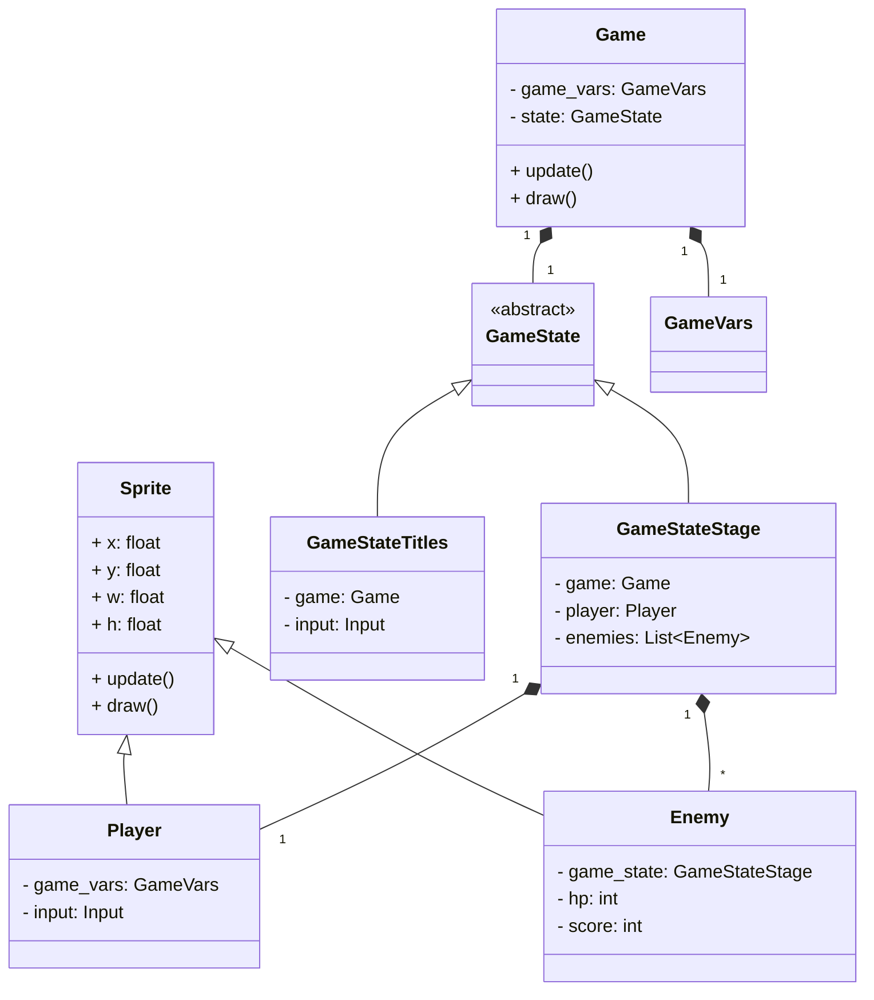

# 클래스 다이어그램

## 개요
이 다이어그램은 프로젝트의 주요 클래스들 간의 관계를 나타냅니다.

## 주요 클래스
1. `Game`: 게임 전체를 관리
2. `Sprite`: 모든 게임 요소의 기본 클래스
3. `Player`, `Enemy`: `Sprite`를 상속하는 주요 게임 캐릭터 클래스

## 클래스 관계

## 클래스 상세 설명
### `Sprite` 클래스
- 게임 내 모든 그래픽 요소의 기본 클래스
- 위치, 크기, 이미지 등의 공통 속성 및 `update()`, `draw()` 메서드 정의

### `GameState` 클래스들
- 게임의 다양한 상태를 관리하는 클래스들의 기본 구조
- `GameStateTitles`, `GameStateStage`, `GameStateComplete` 등의 하위 클래스 존재 