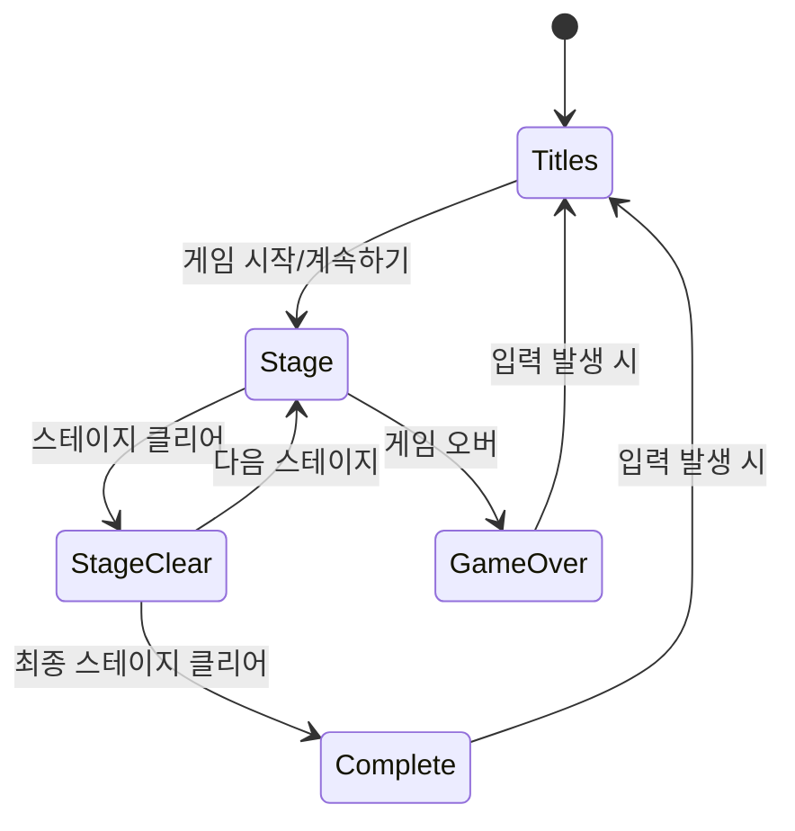

## 게임 상태 관리 구조

### 주요 게임 상태 클래스

게임은 다음과 같은 주요 상태 클래스로 구성됩니다:

1. **`GameStateTitles`**: 타이틀 화면 관리
2. **`GameStateStage`**: 게임 플레이 상태 관리
3. **`GameStateComplete`**: 게임 완료 상태 관리

### 상태 다이어그램

### 클래스별 주요 기능

#### 1. `GameStateTitles`
- 타이틀 화면 표시
- 메뉴 선택 기능 (게임 시작/계속하기)
- 배경 스크롤링 구현

#### 2. `GameStateStage`
- 게임 진행 관리
  - 플레이어 상태 관리
  - 적 및 보스 관리
  - 파워업 관리
- 다양한 하위 상태 관리
  - 게임 진행 중 (PLAY)
  - 일시정지 (PAUSED)
  - 게임 오버 (GAME_OVER)
  - 스테이지 클리어 (STAGE_CLEAR)

#### 3. `GameStateComplete`
- 게임 완료 화면 표시
- 최종 점수 표시
- 배경 스크롤링 구현

### 상태 전환 흐름
1. 타이틀 화면에서 게임 시작/계속하기 선택 시 `GameStateStage`로 전환
2. 스테이지 클리어 시 `STAGE_CLEAR` 상태로 전환
3. 최종 스테이지 클리어 시 `GameStateComplete`로 전환
4. 게임 오버 시 타이틀 화면으로 복귀

### 구현 특징
- 각 상태는 독립된 클래스로 구현되어 유지보수성 향상
- 공통 인터페이스(`update`, `draw`, `on_exit`)를 통해 상태 관리
- 상태 전환은 중앙의 게임 객체를 통해 관리되어 일관성 유지
